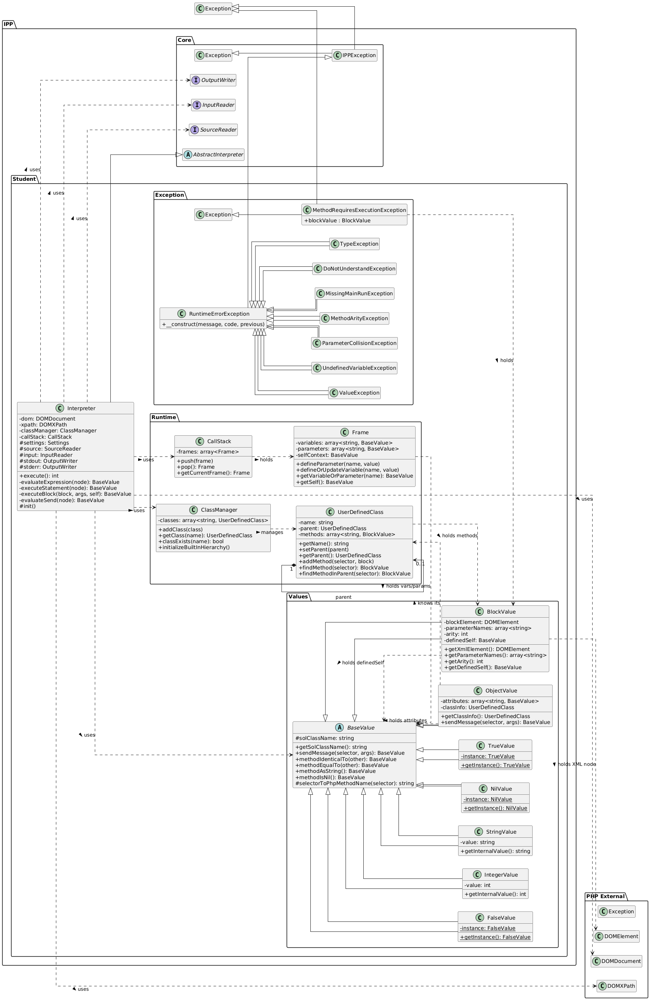

Implementační dokumentace k 2. úloze do IPP 2024/2025
Jméno a příjmení: Gleb Litvinchuk
Login: xlitvi02

## Object-Oriented Design

This solution for the SOL25 interpreter uses an object-oriented way. The main parts are organized into classes within the `IPP\Student` namespace.

### Core Class: `Interpreter`

The `Interpreter` class is the main part of the program. The `Interpreter` class inherits from `IPP\Core\AbstractInterpreter`. Its main jobs are:

* Loading the XML Abstract Syntax Tree (AST) using `DOMDocument` and `DOMXPath`.
* Setting up the runtime environment by creating `Runtime\ClassManager` and `Runtime\CallStack` objects.
* Reading class definitions from the XML and storing them using `ClassManager`.
* Starting the program by calling the `run` method of the `Main` class.
* Walking through the AST nodes (expressions, assignments, message sends) using methods like `evaluateExpression`, `executeStatement`, and `evaluateSend`.
* Executing code blocks found in methods or block literals using the `executeBlock` method.
* Handling the logic for built-in methods (like `print`, `read`) and class methods (`new`, `from:`).
* Working with `Value` objects to represent and manage SOL25 data.

### Runtime Management (`Runtime\` Namespace)

These classes manage the state of the program during execution:

* **`ClassManager`**: This class holds information about all defined SOL25 classes (both built-in and user-defined). It loads built-in classes, adds classes parsed from the XML, and provides access to class details (`UserDefinedClass`) by name. It also helps manage the inheritance hierarchy.
* **`UserDefinedClass`**: Represents the definition of a single SOL25 class. It stores the class name, a reference to its parent class, and a map of its methods (selector string to `BlockValue` object). It includes logic to find methods, looking up the inheritance chain if needed.
* **`CallStack`**: A simple stack that holds `Frame` objects. It manages the order of execution when methods are called or blocks are executed.
* **`Frame`**: Represents a single execution context or scope (like a function call). It stores parameters (which are read-only), local variables, and the current `self` object reference. It handles getting and setting variables, checking for undefined variables, and preventing changes to parameters. It also recognizes special keywords like `nil`, `true`, `false`, `self`, and `super`.

### Value Representation (`Values\` Namespace)

These classes represent all values in SOL25 as objects:

* **`BaseValue`**: An abstract class that all other value classes inherit from. It provides common methods found in the SOL25 `Object` class (like `identicalTo:`, `equalTo:`, `asString`, `isNil`, etc.). It also contains the basic `sendMessage` logic that maps SOL25 message selectors (like `plus:`) to PHP methods (like `methodPlus`).
* **Concrete Value Classes (`IntegerValue`, `StringValue`, `NilValue`, `TrueValue`, `FalseValue`, `BlockValue`)**: These classes inherit from `BaseValue` and implement the specific behavior for each SOL25 data type (e.g., math operations in `IntegerValue`, string operations in `StringValue`). `StringValue` stores strings with escape sequences already processed. `BlockValue` holds the XML element for the block and the `self` context from when it was defined. `NilValue`, `TrueValue`, and `FalseValue` are implemented as Singletons.
* **`ObjectValue`**: Represents instances of user-defined classes (and the base `Object`). It stores instance attributes (including a special internal value for delegation) in an array. Its `sendMessage` method is complex: it first looks for a user-defined method (and throws `MethodRequiresExecutionException` if found), then tries to delegate the message to an internal value (like an integer or string) for specific methods, then calls the base `sendMessage` for common methods, and finally handles dynamic attribute access (getting or setting attributes based on the message selector).

### Exceptions (`Exception\` Namespace)

Specific exception classes are defined (e.g., `DoNotUnderstandException`, `TypeException`, `ValueException`) that inherit from `IPP\Core\IPPException`. This allows catching specific runtime errors and integrating with the framework's error handling to return the correct exit codes. A special `MethodRequiresExecutionException` is used internally to signal that a user-defined method was found and its block needs to be executed by the `Interpreter`.

## Framework Usage (`ipp-core`)

The solution uses the provided `ipp-core` framework widely:

* **Inheritance**: The main `IPP\Student\Interpreter` class extends `IPP\Core\AbstractInterpreter`, gaining access to settings and pre-configured input/output objects.
* **Input/Output**:
    * The `IPP\Core\Interface\SourceReader` (`$this->source`) is used to get the `DOMDocument` from the input XML file. Standard PHP `DOMXPath` is then used to navigate this document.
    * The `IPP\Core\Interface\InputReader` (`$this->input`) is used to read from standard input for the `String::read` class method.
    * The `IPP\Core\Interface\OutputWriter` (`$this->stdout`) is used to write to standard output for the `String::print` method.
* **Settings**: The `IPP\Core\Settings` object is used indirectly through `AbstractInterpreter` to access the configured input/output readers and writers.
* **Error Handling**: Custom exceptions in `IPP\Student\Exception` inherit from `IPP\Core\IPPException`. This allows the `IPP\Core\Engine` to catch them correctly and exit with the appropriate error code defined in `IPP\Core\ReturnCode`.

## Design Patterns Used

Two main design patterns were consciously used in this implementation:

* **Singleton**:
    * **Used for**: `NilValue`, `TrueValue`, `FalseValue` classes.
    * **Reason**: The SOL25 language requires `nil`, `true`, and `false` to be unique objects. The Singleton pattern ensures that only one instance of each of these classes exists throughout the program. Access is provided through a static `getInstance()` method. This matches the language specification and saves memory.
    * **Implementation**: These classes have private constructors and static `getInstance()` methods. Cloning and unserializing are prevented.

* **Interpreter**:
    * **Used for**: The overall structure of the project.
    * **Reason**: The main task is to interpret the SOL25 language based on its AST (represented as XML). The Interpreter pattern is designed for exactly this task: defining a representation for a language's grammar and an interpreter that uses this representation to process input.
    * **Implementation**: The `Interpreter` class acts as the main interpreter, walking the DOM tree. The `Values\*` classes represent the language's values (terminal/non-terminal symbols). The `Runtime\*` classes manage the interpretation context (state, variables, classes).

## UML Diagram

This diagram is based on the solution of IPP project 2. 2024/2025 yy.

